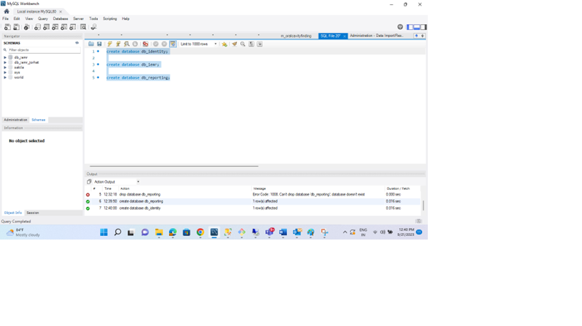

## Overview
AMRIT is primarily built around the Java Spring Boot framework and as outlined in earlier sections provides multiple services oriented around the community health records ecosystem. AMRIT is deployed in multiple states on non-profit model.
Patients, HWCs and PHCs are the key stakeholders. AMRIT can be accessible from various channels like web portal, API access, Mobile app and Tele- medicine.

#### Technology Elements

* Java 8, SpringBoot 1.5.3
* Angular 4 and 5
* Wildfly 11 Final
* MySQL
* Redis (SSO)
* MongoDB - FHIR Resource
* OpenKM on Tomcat
* Git
* Project EKA - HIP Service
* PostgreSQL

## Technical Architecture 

## AMRIT DB restoration

Please find below the zip file of AMRIT blank db with dummy data and global masters.

[blank_db_zip](./Schema_BKP_19092023.zip)

### MYSQL Installation
MySQL is a relational database management system based on SQL – Structured Query Language. The application is used for a wide range of purposes, including data warehousing, e-commerce, and logging applications. The most common use for MySQL, however is for the purpose of a web database.

### Download MySQL from the below link: 

https://dev.mysql.com/downloads/installer/

### Link for installation steps: 

https://software.grok.lsu.edu/Article.aspx?articleid=18737

### DB Restoration Sample steps(link):

### DB Restoration using Workbench:

https://www.greengeeks.com/tutorials/restore-a-mysql-database-from-a-backup-with-mysql-workbench/

### DB Restoration using Commands:

https://blog.devart.com/how-to-restore-mysql-database-from-backup.html

### Required Amrit Schema and Database User Creation:

Create database db_identity;
Create database db_iemr;
Create database db_reporting;

### Run below commands to add users & assign permissions before importing database files

CREATE USER 'testuser'@'%' IDENTIFIED BY 'Test@123';  
GRANT ALL PRIVILEGES ON db_iemr.* TO 'testuser'@'%';  
GRANT ALL PRIVILEGES ON db_identity.* TO 'testuser'@'%';
GRANT ALL PRIVILEGES ON db_reporting.* TO 'testuser'@'%';   

The user and password can be changed in each API for running the Spring application.  

### Importing db_iemr schema from workbench

### Importing global master data & dummy login info

### Importing db_identity schema

### Importing db_reporting schema

